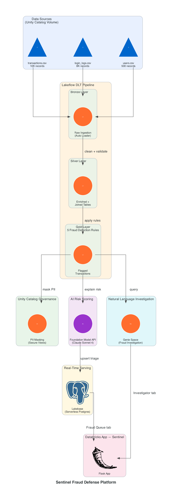
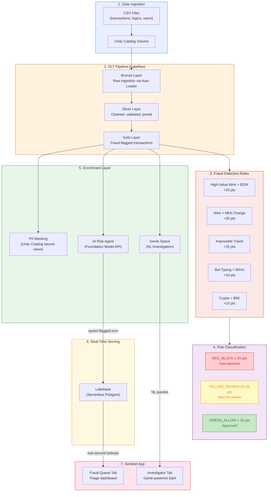

# Agentic Fraud Triage Platform

A full-stack fraud detection and investigation platform built on Databricks, designed for banking and financial services.

## Architecture



## Process Flow



## Components

### Notebooks

| # | Notebook | Purpose | How to Run |
|---|----------|---------|------------|
| 00 | `00_environment_setup` | Creates catalog, schemas, volume | Run as notebook |
| 01 | `01_pii_masking_setup` | Unity Catalog masking functions + secure views | Run as notebook |
| 02 | `02_dlt_fraud_pipeline` | Lakeflow DLT pipeline: ingest CSVs → enrich → flag fraud | Create as DLT pipeline |
| 03 | `03_risk_scoring_agent` | AI reasoning agent using Foundation Model API | Run as notebook |
| 04 | `04_lakebase_triage_store` | Lakebase Postgres provisioning + upsert service | Run as notebook |
| 05 | `05_genie_space_queries` | Certified SQL queries for Genie Space (banking KPIs) | Reference SQL for Genie Space UI |

### Databricks App — Sentinel Fraud Defense Platform

A two-tab Flask application:

- **Fraud Queue** — Real-time triage dashboard backed by Lakebase. Analysts review, release, block, or escalate flagged transactions.
- **Investigator** — Conversational fraud investigation interface backed by Databricks Genie. Ask natural language questions about transactions, anomalies, and fraud KPIs.

## Fraud Detection Rules

| Rule | Condition | Risk Points |
|------|-----------|-------------|
| High-Value Wire | Wire transfer > $10,000 | +25 |
| Wire + MFA Change | Wire > $10K AND MFA recently changed | +30 |
| Impossible Travel | Login > 500 miles in < 10 minutes | +25 |
| Bot Typing | Typing cadence < 80ms | +10 |
| Crypto High-Value | Amount > $5K to crypto merchant | +10 |

### Triage Classification

| Score | Status | Action |
|-------|--------|--------|
| ≥ 50 | `RED_BLOCK` | Auto-blocked |
| 20–49 | `YELLOW_REVIEW` | Held for analyst review |
| < 20 | `GREEN_ALLOW` | Approved |

### Sample Data

The `data/` directory contains mock banking datasets:

| File | Records | Description |
|------|---------|-------------|
| `transactions.csv` | 10,000 | Transaction data with amounts, merchant info, geolocation, fraud labels |
| `login_logs.csv` | 8,000 | Login sessions with IPs, MFA changes, typing cadence, impossible travel flags |
| `users.csv` | 500 | User profiles with names, emails, card numbers |

## Prerequisites

- Databricks workspace with Unity Catalog enabled
- SQL Warehouse
- Lakebase enabled on the workspace

## Setup — Step by Step

### Step 0: Environment Setup (Run as Notebook)

Run `notebooks/00_environment_setup.py` interactively in a Databricks notebook. This creates the catalog, schemas, and volume.

Then upload the sample data to the volume:
```bash
databricks fs cp data/transactions.csv dbfs:/Volumes/cmoon_financial_security/fraud_raw/source_files/transactions.csv
databricks fs cp data/login_logs.csv dbfs:/Volumes/cmoon_financial_security/fraud_raw/source_files/login_logs.csv
databricks fs cp data/users.csv dbfs:/Volumes/cmoon_financial_security/fraud_raw/source_files/users.csv
```

### Step 1: DLT Pipeline (Create as Pipeline — do NOT run as notebook)

`notebooks/02_dlt_fraud_pipeline.py` is a **DLT pipeline definition**, not a regular notebook. Do **not** run it directly.

1. In the Databricks workspace, go to **Workflows → Delta Live Tables → Create Pipeline**
2. Configure:
   - **Pipeline name**: `fraud_detection_pipeline`
   - **Source code**: Select `notebooks/02_dlt_fraud_pipeline.py`
   - **Catalog**: `cmoon_financial_security`
   - **Target schema**: `fraud_silver`
   - **Serverless**: Enabled
3. Click **Start** to run the pipeline

This creates Bronze → Silver → Gold tables with all 5 fraud detection rules applied.

### Step 2: PII Masking (Run as Notebook)

Run `notebooks/01_pii_masking_setup.py` interactively. This creates:
- Masking functions (`mask_card_number`, `mask_email`, `mask_ip`) in Unity Catalog
- Secure views in `fraud_serving` schema with PII redacted

> **Note**: Run this after the DLT pipeline completes, since it creates views on top of the Silver/Gold tables.

### Step 3: Risk Scoring Agent (Run as Notebook)

Run `notebooks/03_risk_scoring_agent.py` interactively. This:
- Reads flagged transactions from the Gold table
- Calls the Foundation Model API (`databricks-claude-sonnet-4`) to generate human-readable risk explanations
- Saves results to `fraud_serving.ai_risk_assessments`

> **Note**: Requires a Foundation Model endpoint to be available on the workspace.

### Step 4: Lakebase Triage Store (Run as Notebook)

Run `notebooks/04_lakebase_triage_store.py` interactively. This:
- Provisions a Lakebase (Serverless Postgres) instance
- Creates the `real_time_fraud_triage` table with indexes
- Upserts flagged transactions from the Gold table into Lakebase for sub-second lookups

> **Note**: Requires Lakebase to be enabled on the workspace.

### Step 5: Genie Space (Manual UI Setup)

The Genie Space is configured through the Databricks UI, not via notebook.

1. In the Databricks workspace, go to **Genie** (left sidebar)
2. Click **New** to create a new Genie Space
3. Configure:
   - **Name**: `Fraud Investigation Assistant`
   - **SQL Warehouse**: Select your serverless SQL warehouse
   - **Tables**: Add the relevant tables from `cmoon_financial_security.fraud_silver` and `cmoon_financial_security.fraud_serving`
4. Add certified SQL queries from `notebooks/05_genie_space_queries.sql`:
   - In the Genie Space settings, go to **Sample questions** or **Instructions**
   - Add the SQL queries as example questions with their corresponding SQL
5. Note the **Genie Space ID** from the URL (you'll need it for the app config)

### Step 6: Databricks App (Deploy via CLI)

Deploy the Sentinel app from the `app/` directory.

1. **Create the app**:
   ```bash
   databricks apps create --json '{"name": "fraud-queue", "description": "Sentinel Fraud Defense Platform"}'
   ```

2. **Upload app files** to your workspace:
   ```bash
   databricks workspace mkdirs /Workspace/Users/<your-email>/fraud_queue_app/static
   # Upload app.py, app.yaml, requirements.txt, and static/logo.svg
   ```

3. **Update `app.py` configuration** — set these variables to match your environment:
   - `LAKEBASE_HOST`: Your Lakebase instance hostname
   - `LAKEBASE_DB`: Database name (e.g., `fraud_triage`)
   - `GENIE_SPACE_ID`: The Genie Space ID from Step 5
   - `WAREHOUSE_ID`: Your SQL Warehouse ID

4. **Deploy**:
   ```bash
   databricks apps deploy fraud-queue --source-code-path /Workspace/Users/<your-email>/fraud_queue_app
   ```

5. **Grant permissions** to the app's service principal:
   - `CAN_RUN` on the Genie Space
   - `CAN_USE` on the SQL Warehouse
   - `USE CATALOG`, `USE SCHEMA`, `SELECT` on relevant Unity Catalog objects

## Customer Requirements Addressed

- **Explainability** — Every blocked transaction includes a human-readable justification (GDPR/CCPA compliant)
- **Low-Latency** — Lakebase provides sub-second lookups for block/allow decisions
- **PII Protection** — Unity Catalog masking functions ensure analysts see only necessary data
